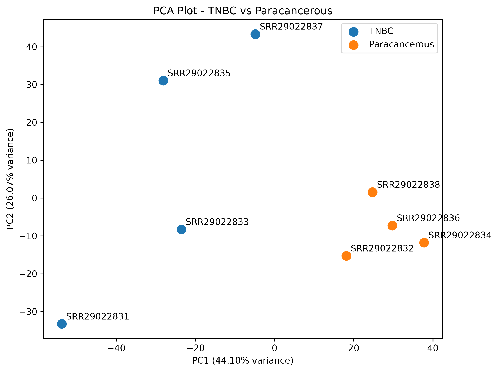
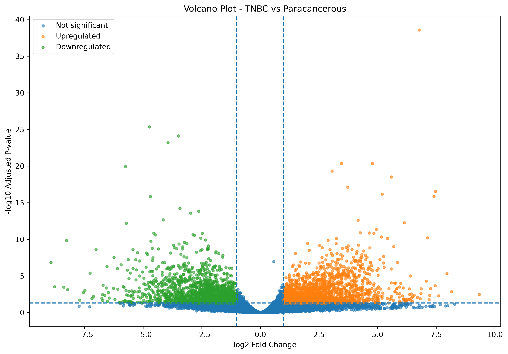
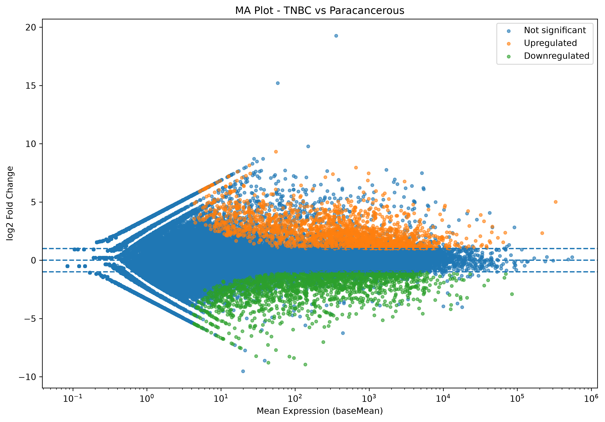
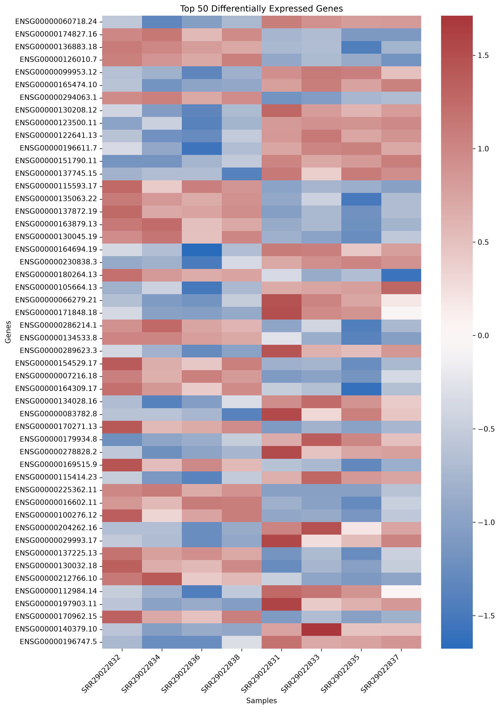
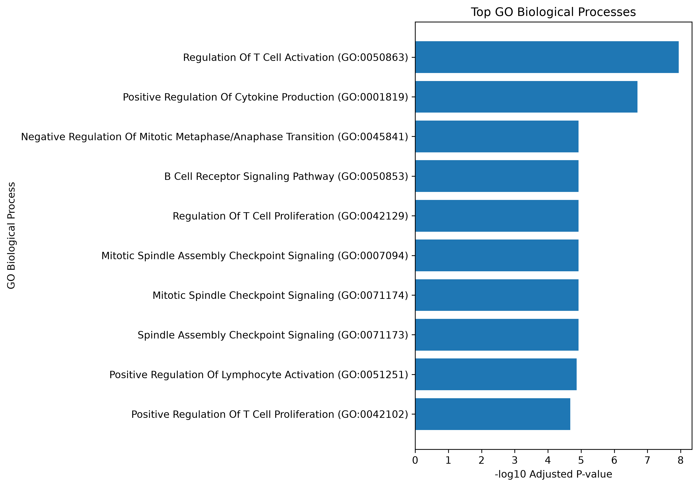
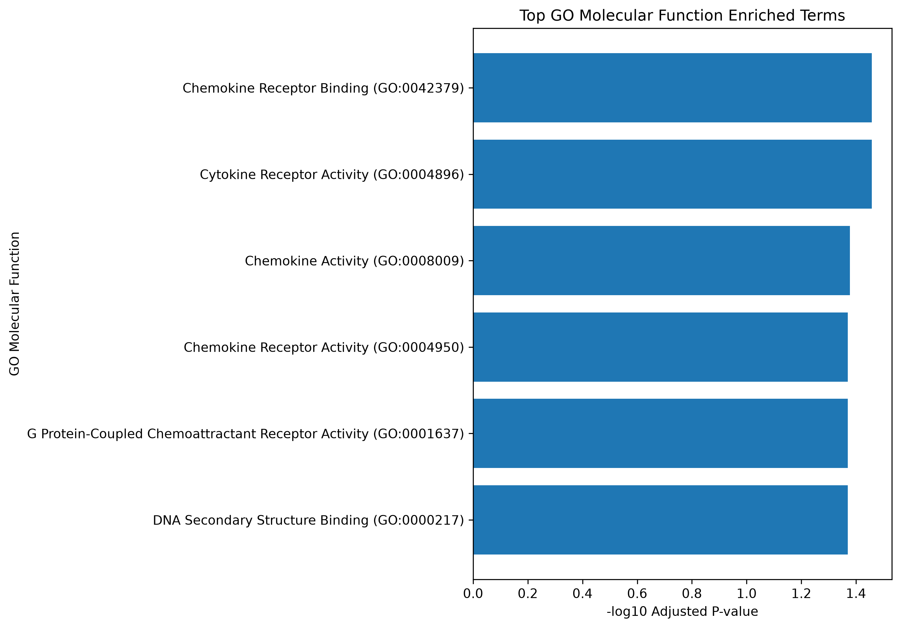
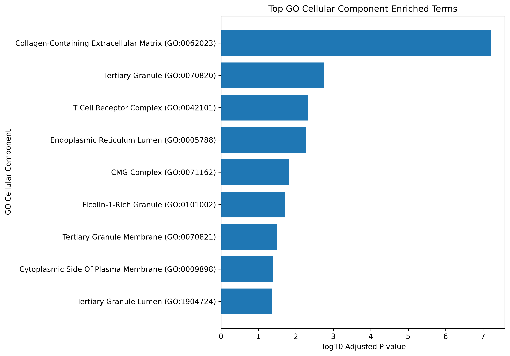
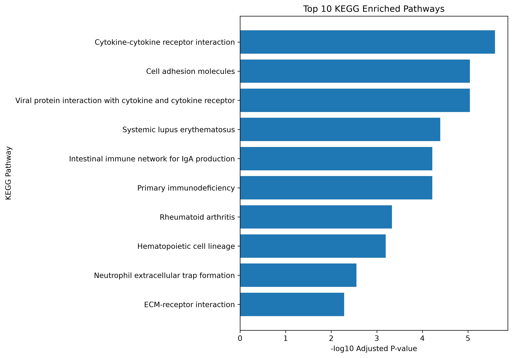

# TNBC RNA-seq Differential Expression Analysis

## Project Overview

This project performs a Python-based RNA-seq differential expression analysis of **Triple-Negative Breast Cancer (TNBC)** compared with **paracancerous breast tissue**.

The analysis starts from a gene-level count matrix and metadata, followed by data preprocessing, differential expression analysis, visualization, functional enrichment, and annotation of significant genes.

The project demonstrates a reproducible computational biology workflow using Python and commonly used bioinformatics analysis approaches.

---

## Research Objective

The primary objective of this project is to identify genes that are differentially expressed between:

- **TNBC tissue**
- **Paracancerous breast tissue**

The identified differentially expressed genes (DEGs) are further investigated to understand their associated biological functions and pathways.

---

## Analysis Workflow

```text
Gene Count Matrix
        |
        v
Data Loading & Quality Checks
        |
        v
Metadata Preparation
        |
        v
Differential Expression Analysis
        |
        v
DEG Categorization
        |
        +------------------+
        |                  |
        v                  v
       PCA          Volcano / MA Plot
        |                  |
        +--------+---------+
                 |
                 v
          Top DEGs / Heatmap
                 |
                 v
        Functional Enrichment
          /             \
         v               v
       GO               KEGG
    BP / MF / CC
         |
         v
   DEG Annotation
         |
         v
   Final Project Summary

 ## Project Structure

   TNBC_RNAseq_Python/
│
├── data/
│   ├── counts/
│   │   └── gene_counts.txt        # Large raw count file (not tracked by Git)
│   │
│   └── metadata/
│       └── metadata.csv
│
├── results/
│   ├── GO_enrichment/
│   │   ├── GO_BP/
│   │   ├── GO_CC/
│   │   ├── GO_MF/
│   │   ├── GO_BP_results.csv
│   │   ├── GO_CC_results.csv
│   │   ├── GO_MF_results.csv
│   │   └── DEG_gene_symbols.csv
│   │
│   ├── KEGG_enrichment/
│   │   ├── KEGG_results.csv
│   │   └── KEGG_top10.png
│   │
│   ├── PCA_plot.png
│   ├── MA_plot.png
│   ├── Volcano_plot.png
│   ├── Heatmap_Top50_DEGs.png
│   ├── PCA_coordinates.csv
│   ├── Top50_DEGs.csv
│   ├── significant_DEGs.csv
│   ├── differential_expression_results.csv
│   ├── differential_expression_categorized.csv
│   ├── final_annotated_DEGs.csv
│   └── final_project_summary.txt
│
├── scripts/
│   ├── 01_load_counts.py
│   ├── 02_prepare_metadata.py
│   ├── 03_differential_expression.py
│   ├── 04_pca.py
│   ├── 05_volcano_ma.py
│   ├── 06_heatmap.py
│   ├── 07_go_enrichment.py
│   ├── 08_go_mf_cc.py
│   ├── 09_kegg_enrichment.py
│   ├── 10_annotate_degs.py
│   └── 11_final_summary.py
│
├── .gitignore
└── README.md

---

## Key Analysis Steps

### 1. Count Matrix Preparation

The project uses a gene-level count matrix as the starting point for RNA-seq differential expression analysis.

The large count file is intentionally excluded from the GitHub repository because GitHub has a 100 MB file size limit.

The `.gitignore` file prevents large sequencing and count files from being committed accidentally.

### 2. Metadata Preparation

Sample metadata are prepared to define the experimental groups:

- **TNBC**
- **Paracancerous breast tissue**

The metadata are used to associate each sample with its corresponding biological condition.

### 3. Differential Expression Analysis

Differential expression analysis is performed to identify genes whose expression differs between the two experimental groups.

The analysis produces:

- Complete differential expression results
- Significant DEGs
- Categorized DEGs
- Annotated DEGs

### 4. Principal Component Analysis

Principal Component Analysis (PCA) is used to visualize the overall structure of the samples and assess separation between the experimental groups.

**Output:**

`results/PCA_plot.png`

### 5. Volcano Plot and MA Plot

Volcano and MA plots are generated to visualize differential expression results.

**Outputs:**

- `results/Volcano_plot.png`
- `results/MA_plot.png`

### 6. Heatmap

A heatmap of the top 50 differentially expressed genes is generated to visualize expression patterns across samples.

**Output:**

`results/Heatmap_Top50_DEGs.png`

### 7. Gene Ontology Enrichment

Significant DEGs are investigated using Gene Ontology (GO) enrichment analysis.

Three GO categories are considered:

- **Biological Process (BP)**
- **Molecular Function (MF)**
- **Cellular Component (CC)**

The enrichment results and visualization files are available under:

`results/GO_enrichment/`

### 8. KEGG Pathway Enrichment

KEGG pathway enrichment is performed to identify biological pathways associated with the identified DEGs.

**Output:**

`results/KEGG_enrichment/`

### 9. DEG Annotation

Significant genes are further annotated to obtain gene symbols and generate final annotated DEG tables.

---

---

## Results & Visualizations

The analysis generated multiple visualizations to assess sample structure, differential expression, and functional enrichment.

### Principal Component Analysis

PCA was used to visualize sample-level variation and assess separation between TNBC and paracancerous breast tissue samples.



### Differential Expression

The Volcano Plot and MA Plot summarize the differential expression results.

#### Volcano Plot



#### MA Plot



### Top Differentially Expressed Genes

A heatmap of the top 50 differentially expressed genes was generated to visualize expression patterns across samples.



### Gene Ontology Enrichment

GO enrichment analysis was performed across:

- Biological Process (BP)
- Molecular Function (MF)
- Cellular Component (CC)

#### Biological Process



#### Molecular Function



#### Cellular Component



### KEGG Pathway Enrichment

KEGG enrichment analysis was performed to identify pathways associated with the identified DEGs.



---

---

## Technologies & Tools

### Programming

- Python
- Pandas
- NumPy
- Matplotlib
- Seaborn

### Bioinformatics & Statistical Analysis

- RNA-seq differential expression analysis
- Principal Component Analysis (PCA)
- Gene Ontology (GO) enrichment
- KEGG pathway enrichment
- DEG annotation

### Development Environment

- Visual Studio Code
- Python virtual environment
- Git
- GitHub

---

## Reproducibility

The analysis has been organized into sequential Python scripts following a structured workflow.

```text
01 → Load count data
02 → Prepare metadata
03 → Differential expression analysis
04 → PCA
05 → Volcano and MA plots
06 → Heatmap
07 → GO Biological Process enrichment
08 → GO Molecular Function & Cellular Component enrichment
09 → KEGG enrichment
10 → DEG annotation
11 → Final project summary

---

## Author

**Suraj Kumar Chanda**

GitHub: [shurajkr1412](https://github.com/shurajkr1412)

---

## Disclaimer

This project is intended for educational and research portfolio purposes and demonstrates an RNA-seq data analysis workflow using the available project dataset.

